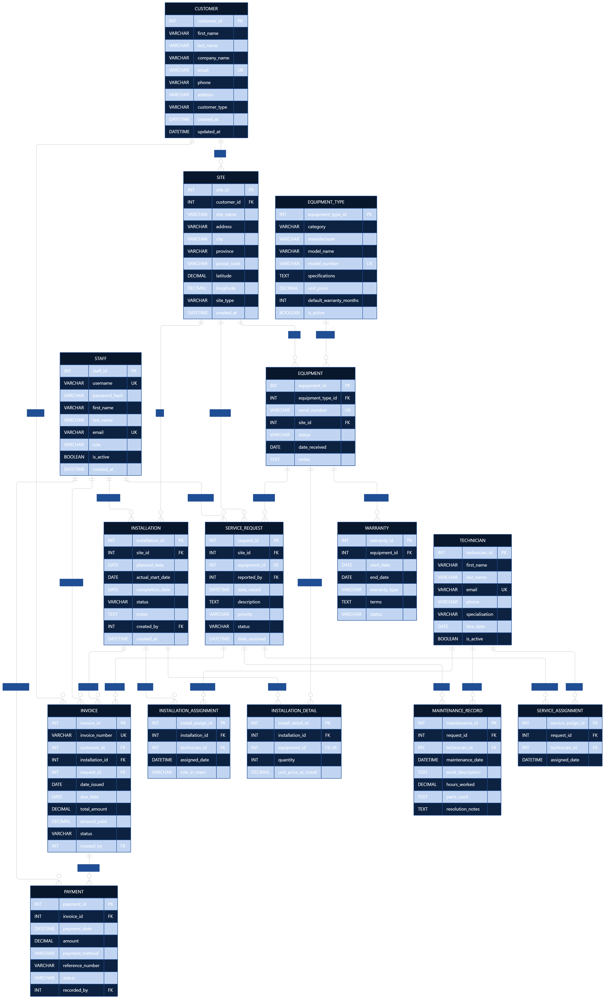

# SolarGrid — Entity Relationship Diagram

## Design Notes

- **Staff vs Technician:** Intentionally separate; a person may exist in both tables.
- **InstallationDetail UNIQUE on equipment_id:** Enforces DB-05 (one equipment, one installation).
- **Bridge entities** carry relationship attributes (price snapshot, role_in_team, assigned_date).
